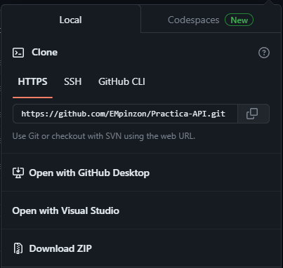
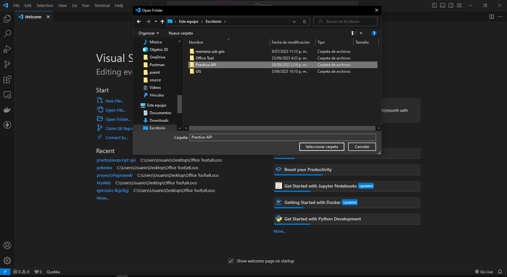
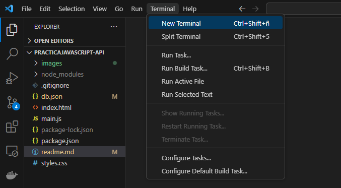
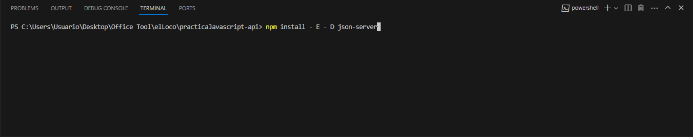
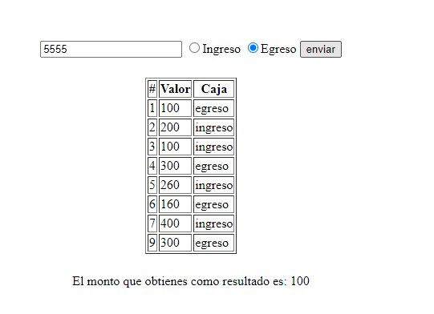
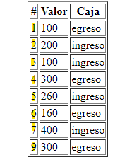
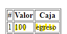
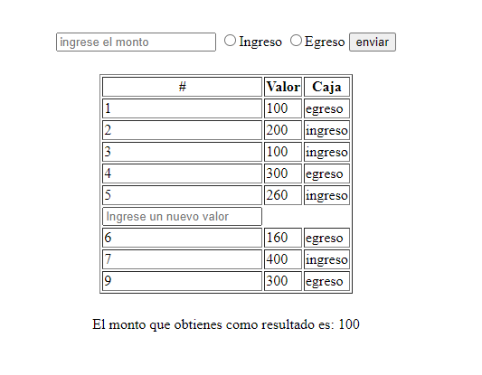
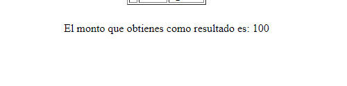

# Prascticas API

Este es un proyecto con el fin de practicar los conceptos vistos en clase acerca de la manipulacion de el dom y el manejo de la api fetch

## Tecnologias usadas

para la creacion de este proyecto se utilizo las siguientes tecnologias :
+ **HTML** para la creacion de el diseño web
+ **Javascript** para manejar la logica de el sitio web
+ **json-server** para el manejo de la api fetch y el intercambio de informacion con un servidor
+ **css** para la dispocicion de los elementos

## Descripcion de el proyecto 

Con este proyecto podras tener un registro basico de tus ingresos y egresos a lo largo de el tiempo. Este proyecto te servira para obtener el registro de ingresos y egresos que obtienes de algun negocio o de tu finanzas personales ademas de el monto total que tienes de saldo, sea positivo o negativo.

## Configuracion de la aplicacion

Te mostrate como descargar y ejecutar esta aplicacion

  <h3>Debes tener node en tu computador, lo puedes decargar <a target="_blank" href="https://nodejs.org/es">aqui</a> </h3>
  <h3>Puedes descargar este proyecto dando click en Download zip</h3>
  
  <h3>Una vez lo tengas, lo abres con visualStudio code</h3>
  
  <h3>Debes abir una nueva terminal </h3>
  
  <h3>Si no tienes instalado js server lo instalas con el comando : npm install - E - D json-server </h3>
  
  <h3>Debes ejecutar el comando npm run dev, para poner a funcionan js server</h3>
   

## Uso de de la aplicacion

A continuacion te mostrate como interactuar con el programa 

### Ingresar nuevo registro 

  <h5>Debes ingresar el valor y y tipo de valor en la parte superior y dar click en enviar</h5>
  

### Eliminar registro

  <h5>Debes dar click en el numero de id de cada registro, este numero se encuentra en la primera fila </h5>
  

### Modificar registro

  <h5>Debes dar click en ya sea el espacio de valor o el espacio de caja de cada registro</h5>
  
  <h5>Un input se abrira y para guardar tus cambios debe dar click en enter</h5>
  

Debes tener en cuenta que el input validara informacion que ingresaste, por ejemplo si diste click en el valor, solo podras ingresar numeros en el nuevo input. Si diste click en la caja, solo podras ingresar  ingreso o egreso

### Monto acumulado

  <h5>Puedes ver el monto acumulado entre ingresos y egresos en la parte de abajo, el saldo puede ser positivo o negativo</h5>
  

## Autor 

[Edgar Mauricio Pinzon Monsalve](https://github.com/EMpinzon)

